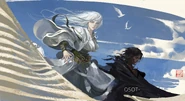

> **剧透警告**，正如你可能猜到的那样。

《蛊真人》是我最喜欢的升级流小说之一，我一直对故事中蕴含的文学分析潜力印象深刻。我有点困惑，为什么我看到这么多人把这个故事描述成一个美化邪恶的空洞的权力幻想，所以我决定写一篇关于故事中道德的文章，以此来分享我为什么认为它很棒。希望我写过的那些大学论文能帮上忙，让我自己被理解。

提到《蛊真人》时，人们通常会提到的第一件事是，主角方源是一个500岁的反派，他的性格是彻头彻尾的邪恶。虽然作者使用了一些技巧来让读者尽可能地同情和投入到主角身上，但我认为这并不意味着作者打算美化邪恶和否定道德。事实上，拥有一个反派主角为讨论道德提供了一些独特的机会。故事以复杂的方式讨论道德的方式有很多。其中包括：道德与成功之间的关系，将蛊世界的一些元素用作中国的隐喻，以及故事中神话般的仁祖传奇。

---

## 一、道德与成功：并非对立的悖论

对《蛊真人》的一个常见批评是，其反派主角的成功使其变得前卫、有问题，或者作者对人性的运作方式产生了错觉。然而，"魔道"的相对好处通常与蛊世界的独特幻想元素以及这个世界基本上是一个地狱世界的方式明确地联系在一起。方源最初是一个来自地球的穿越者，他将我们的世界与蛊世界进行比较，经常注意到他的魔道行为在地球上会迅速导致监禁或死亡。他多次提到，个人能够比整个组织更强大，这在许多情况下会削弱真诚的合作，这与熟悉的仙侠思想"在这个世界上，两只手可以比四只手更强大"一样。因此，作者确保指出，方源在现实世界中的反社会行为不应该被模仿，即使是在只考虑好处的愤世嫉俗的层面上。

此外，《蛊真人》总是努力展示道德和合作的力量和好处，突出了蛊世界的悲剧性，以及如果不是因为魔法系统的反常激励，事情会如何改善。商欣慈能够通过善良和仁慈成为商氏家族的领袖，利用盟友和下属的忠诚和感激来击败她的对手，而这些都是她通过善行获得的。中洲强大到足以同时对抗其他四个地区，因为它拥有更具包容性的社会组织。宗门制度允许中洲招募来自各种背景和出身的有才华的人，而其他四个地区则因其对氏族制度的依赖而瘫痪，该制度难以融入非家族/血统的人。乐土仙尊为改善世界所做的努力确实有所作为，他建立的乐土让来自不同物种的人们和谐地生活在一起。他为东海的人鱼和人类之间的和平所做的安排，在他死后持续了数千年，直到故事的今天。

---

## 二、方源的"道德利用"：超越偏见的智慧

《蛊真人》不仅通过英雄人物展示了道德的力量，还通过方源愤世嫉俗地利用道德和合作来获得好处。与方源的魔道行为不同，他对道德的使用并不依赖于幻想元素，并且可以应用于现实世界。方源不断地依赖普世主义和打破偏见来获得盟友，而且一次又一次地，这拯救了他的生命，让他能够逃离或击败那些受到偏见或仇恨束缚的更强大的敌人。实际上，在故事的一半时间里，他与琅琊福地异人的合作是他成长和生存的基础，而异人与标准人类之间痛苦的种族仇恨阻止了他的敌人像他试图与人类势力避难时那样利用琅琊来针对方源。在故事后期，当方源达到修炼的巅峰，成为世界上的主要力量时，他颇具讽刺意味地称自己为"大爱仙尊"，并愤世嫉俗地声称乐土的和平与合作的遗产是他派系招募追随者的基础。方源招募来自所有种族和出身的人是他后期章节中的一个巨大力量支柱。因此，拥有一个无道德的主角，可以让故事清楚地探索善的益处和力量，通过消除主角为了自身利益而这样做的动机。

---

## 三、蛊世界的隐喻：对现实的批判

作者有趣地将他的幻想世界用作谈论当今中国的载体，不幸的是，这导致了这部小说被中共封禁。天庭，蛊世界中控制中洲的最强大的组织，可以被理解为中国政府的隐喻。这在中洲控制的摧毁命运蛊的战争中最为明显，以及天庭对异人的永恒灭绝运动中。总的来说，主题似乎是，共产党当年通过解放中国摆脱欧洲和日本的殖民统治做了一些好事，但专制主义已经成为一种压迫性和停滞的力量，压制了寻求自由和幸福的人民。在摧毁命运的战争中，在天庭的控制下，这是对中国政府专制主义的隐喻，天庭使用了一种名为"人民英雄"的举措，利用人民的意志来增强他们的力量。然而，事实证明，他们只使用了人民意志的一小部分，当所有意志都被释放时，寻求摧毁命运的入侵势力会获得更大的推动力，从而使命运得以摧毁。这代表了中国共产党内部的伪民主所产生的虚假共识实际上是一种幻觉，而所有人民的真正意志都渴望自由。

> "在场的所有人中，人民英雄对方源的增幅实际上是最强的。
>
> "为什么？为什么！？你明明是一个给世界带来灾难的恶魔，你是一个犯下无数罪行的恶魔！你为什么会得到人类意志的最大帮助？"龙公震惊而愤怒地咆哮道。
>
> "你还不明白吗？龙公！现在时代已经不一样了，人民的心已经变了！"
>
> "在远古时代，人类寻求生存空间。因此，三大魔尊在入侵天庭时有所保留。"
>
> "而现在，距离远古时代结束已经超过一百万年了！你的天庭现在已经无法代表世界上所有人类的意志了！"
>
> "这些是世界上几乎所有人的内心声音！"
>
> "他们不想再被束缚，他们渴望自由，即使这种自由是不切实际的！有时候，人们就像疯子一样，他们有愚蠢的想法。"
>
> "我将诚实地告诉你。"沈从生实际上流下了深情的眼泪："我从未有过这种感觉。就好像有无数的人站在我身后，为我欢呼和鼓励。也许这就是当时天庭的蛊仙为人类而战时的感受。"
>
> "我来到这个战场真是个正确的决定！"

除了专制主义之外，《蛊真人》的作者还用天庭来批判中国民族主义。天庭在远古时代将人类从异人的奴役中解放出来，但他们保留了一种受害者情结，并在保护人类不再必要之后，继续对异人进行灭绝战争。二战期间的民族主义帮助中国击退了日本的入侵，并收回了殖民地特权，但在今天，它导致了对藏族人和维吾尔族人等群体的可怕罪行。作者的这些非常直接的伦理批评是非常勇敢的，几乎可以肯定这是这部小说被中共封禁的原因。

---

## 四、仁祖传奇：追求自由的寓言

仁祖传奇可能是我最喜欢的故事中的故事。一般来说，传奇的一个独立部分与主故事的一个部分一起出现，它们相互平行，提供了一个很好的道德故事，其中经常引用著名的神话故事。例如，仁祖传奇的这一部分出现在我上面讨论的命运之战弧线中。

### 失去翅膀的鸟

一天早上，一群鸟从仁祖身边跑过。

这些鸟没有翅膀，它们的六条腿交替地在地上移动，在它们的路径上扬起尘土。

仁祖看到这些鸟时欣喜若狂。

"所以我是一只鸟！" 他也张开双腿，疯狂地奔跑，加入了鸟群。

这些鸟向仁祖奇怪地咆哮着："你是一个人，你用两条腿走路，你不是一只鸟。离开，不要打扰我们，我们正在追逐自由蛊，我们想找回我们的自由。"

仁祖问道："你们为什么要寻找自由蛊？"

这些鸟用沉重的语气说："我们曾经拥有自由蛊，但我们没有意识到这一点。只有在失去它之后，我们才发现我们不再有翅膀，再也不能飞了。当我们重新获得自由时，我们将能够再次张开翅膀，飞向天空。"

仁祖意识到："我明白了，人类也需要自由。如果人类没有自由，他们就会像失去翅膀的鸟一样。"

"对！我现在想起来了！" 仁祖拍手大笑："我也需要寻找自由来摆脱命运的束缚。在那之后，我可以去任何我想去的地方，永远和我想在一起的人在一起。"

这些鸟奇怪地看着仁祖："哦，人类，你怎么会有这种荒谬的想法？"

"看看我们，鸟怎么能没有翅膀呢？所以，追逐自由是我们的职责的一部分。"

"但你们人类注定要孤独，所有的聚会最终都会分开。哦，人类，你想追求自由，但你也需要遵守你的本性，你不应该沉迷于疯狂的幻想。"

仁祖挠了挠头，感到困惑："是这样的吗？"

这些鸟留下了最后的遗言："哦，人类，让我们给你一些诚恳的建议。如果你将来获得了自由，你必须珍惜它，不要像我们一样放手。不要让自由蛊飞走，否则你会后悔的。"

在仁祖与这些鸟分开后，他再次慢慢地忘记了他的身份和目标。

### 没有牙齿的豹

一天下午，一群蓝豹从他身边经过。

疯狂的仁祖看到这群豹子，高兴地喊道："所以我是一只豹子。"

仁祖冲进了这个群体。

但这些豹子推开了他，喊道："你是一个人，不是一只豹子。你用两条腿走路，而我们有四条腿。离开，不要打扰我们。我们正在追逐自由蛊，我们想找回我们的自由。"

仁祖问道："你们为什么要寻找自由蛊？"

这些蓝豹看起来很沮丧："唉，我们曾经拥有自由蛊，但我们没有意识到这一点。只有在失去它之后，我们才发现我们不再有牙齿，无法咬碎和撕裂我们的猎物。当我们重新获得自由时，我们将能够再次快乐地进食。"

仁祖意识到："我明白了，人类也需要自由。如果人类没有自由，他们就会像没有牙齿的野兽一样。"

"对！" 仁祖拍手大笑："我需要寻找自由来摆脱命运的束缚。我将拥有无数的美食和美酒，无尽的财富，以及各种舒适美丽的衣服。"

这些蓝豹惊呆了，然后大声嘲笑仁祖："哦，人类，你怎么会有这种荒谬的想法？"

"看看我们，野兽怎么能没有獠牙或爪子呢？所以，追逐自由是我们的职责的一部分。"

"但你们人类生来就空手而归，最终将一无所有。哦，人类，你想追求自由，但你也需要遵守你的本性，你不应该沉迷于疯狂的幻想。"

仁祖挠了挠头，不满意："是这样的吗？"

这些豹子留下了最后的遗言："哦，人类，让我们给你一些诚恳的建议。如果你将来获得了自由，你必须珍惜它，不要像我们一样放手。不要让自由蛊飞走，否则你会后悔的。"

在仁祖与这些豹子分开后，他再次慢慢地忘记了他的身份和目标。

### 失去鳃的鱼

一天晚上，一群鱼从他身边游过。

仁祖看到这些鱼，高兴地喊道："所以我是一条鱼。"

仁祖加入了鱼群，试图像它们一样游泳。

鱼群中一片骚动，它们推开了仁祖，喊道："你是一个人，不是一条鱼。你用两条腿走路，而我们没有腿。离开，不要打扰我们。我们正在追逐自由蛊，我们想找回我们的自由。"

仁祖问道："你们为什么要寻找自由蛊？"

这些鱼叹了口气："我们曾经拥有自由蛊，但我们没有意识到这一点。只有在失去它之后，我们才发现我们不再有鳃，再也不能在水中呼吸了。当我们重新获得自由时，我们将能够再次在水中游泳。"

仁祖意识到："我明白了，人类也需要自由。如果人类没有自由，他们就会像没有鳃而无法呼吸的鱼一样。"

"对！" 仁祖拍手大笑："我需要寻找自由来摆脱命运的束缚。我将自由呼吸，永远活着，我想要永生！"

这些鱼嘲笑道："哦，人类，你怎么会有这种荒谬的想法？"

"看看我们，一条鱼必须有鳃，所以追逐自由是我们的职责的一部分。"

"但你们人类注定与永生无关，你们会老死和生病。哦，人类，你想追求自由，但你也需要遵守你的本性，你不应该沉迷于疯狂的幻想。"

仁祖皱着眉头，感到恼火："是这样的吗？"

这些鱼留下了最后的遗言："哦，人类，让我们给你一些诚恳的建议。如果你将来获得了自由，你必须珍惜它，不要像我们一样放手。不要让自由蛊飞走，否则你会后悔的。"

在仁祖与这些鱼分开后，他慢慢地忘记了鸟、豹和鱼的建议。

> "我是一个人，我需要追求自由！"
>
> "我需要摆脱命运的束缚，我想和我的爱人永远生活在一起，我想用足够的财富享受生活，我想永远活着。"

许多从仁祖身边走过的人都听到了他的话，他们摇了摇头，远离了他。

"我们快点离开吧，他是仁祖，他又在胡说八道了。"

"他已经完全疯了。"

"他怎么敢有这样的想法？"

---

## 五、追求不可能的梦想

《蛊真人》的一个主要主题是角色追求不可能的梦想，即使他们没有成功的现实期望，方源对永生的追求就是最明显的例子。在一些角色赞成命运/权威的地方，存在一定程度的模糊性和解释空间，但我认为作者的观点是，即使社会称你为疯子并将你推入你的位置，追求你的梦想也是正确的。在这里，仁祖传奇被用来简洁地说明这一点，人们不禁为被命运束缚的仁祖感到愤慨，但他却被告知他追求自由是错误的，而且是不可能的。

总而言之，《蛊真人》对道德有很多讨论，并且不仅仅因为主角是反派而空洞地美化邪恶。当然，不喜欢一个故事并觉得它不适合你也没关系，但我认为《蛊真人》有一些真正的内涵，而且不是一个平淡的权力幻想，这相当客观。我期待着阅读作者的下一个故事，并希望他们有一天能够获得完成《蛊真人》的自由。