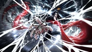
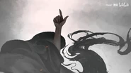
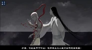
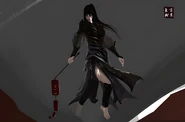

## 摘要

《蛊真人》作为网络文学暗黑修真流派的标杆性作品，彻底打破传统仙侠小说"善恶分明、正道必胜"的固化叙事模板。小说以主角古月方源的长生求索之路为主线，构建了一套以蛊道体系为核心、弱肉强食为底层逻辑的残酷修真世界。作品摒弃网络爽文常见的圣母叙事、机缘巧合与道德滤镜，以极致理性、绝对利己的叙事内核，解构传统仙侠的侠义精神与价值体系，直面人性博弈、规则桎梏与生存本质。

---

## 一、引言

在国内网络仙侠文学的发展历程中，绝大多数作品长期陷入叙事同质化困境：主角多为正义化身，秉持惩恶扬善、济世救人的传统道义，成长路径依赖气运加持、贵人相助与偶然机缘，最终实现正道圆满、得道飞升的标准化结局。这类作品以理想化的道德叙事迎合大众审美，构建出脱离现实的侠义乌托邦，但也逐渐丧失了文学作品应有的人性深度与思辨价值。

《蛊真人》的出现彻底颠覆了这一创作范式，成为继《亵渎》之后暗黑流网络文学的代表性作品。小说跳出"正邪对立"的二元叙事框架，塑造了网络文学中极具颠覆性的反英雄主角古月方源。作者摒弃道德美化与剧情滤镜，以冰冷、客观的笔触刻画修真世界的资源争夺、人性幽暗与规则虚伪，将生存竞争、利益博弈、理性抉择作为叙事核心，赋予仙侠小说罕见的现实主义思辨色彩。

自问世以来，《蛊真人》的舆论评价呈现极致的两极分化：支持者认为其打破套路、直面真实，是兼具思想深度与逻辑架构的网络文学佳作；批判者则认为其宣扬极端利己主义、颠覆公序良俗，存在严重的价值观偏差。基于此，本文立足文本本身，客观审视作品的创新价值与创作短板，辩证剖析其独特的文学魅力与思想局限。

---

## 二、叙事革新：对传统仙侠叙事体系的彻底解构

### 2.1 颠覆"正道正义"的虚假叙事

传统仙侠小说普遍构建"正道光明、魔道邪恶"的固化认知，将宗门正道塑造成道义的化身，赋予其天然的正义性，而魔道势力则被标签化为邪恶、暴戾的代名词，善恶边界绝对清晰、不容模糊。

《蛊真人》彻底击碎了这一虚假叙事，重新解构修真世界的权力与正义本质。小说中，所谓的天庭正道、名门宗门，并非道义的守护者，而是垄断资源、掌控规则、固化阶级的既得利益者。天庭依靠宿命蛊操控众生命运，以"天道大义"为幌子，肆意牺牲底层修士与凡人的利益，维护自身的绝对统治；各大正道宗门以仁义道德为包装，实则内部倾轧、虚伪狡诈，为争夺资源不择手段。

作品尖锐揭露了"正义即强权"的残酷真相：世间没有绝对的道义，只有掌控规则者定义的善恶。所谓正道的仁义道德，不过是统治阶层束缚底层、掩盖资源掠夺本质的工具，彻底打破了传统仙侠对"正统正义"的理想化崇拜，完成了对传统仙侠价值体系的根本性解构。

### 2.2 摒弃爽文套路，构建理性生存叙事

传统网络爽文普遍存在"主角光环"泛滥的问题，主角成长充满偶然性，顿悟突破、天降机缘、贵人相助等不可控剧情成为核心推动力，叙事逻辑松散，缺乏合理的行为支撑。

《蛊真人》彻底摒弃了这类悬浮化叙事，构建起一套极致理性、可推演、可迭代的生存叙事体系。主角方源的每一次成长、每一次抉择，均基于完整的风险评估与收益计算，摒弃情绪、怜悯、冲动等非理性因素。无论是瘴雾墟三选其一的绝境抉择，还是墨墟资源争夺的最优策略布局，亦或是多次重生后的布局隐忍，方源的所有行为均服务于"长生"这一核心目标，无多余情绪化剧情，无盲目善良，无侥幸投机。

小说将生存与成长建模为一场精密的博弈游戏，否定气运、机缘、顿悟等玄学变量，以绝对理性贯穿全程，让剧情推进完全依托逻辑与策略，摆脱了爽文叙事的低级趣味，形成了独有的硬核叙事风格。

### 2.3 重构世界观：以蛊道体系打造严谨的幻想逻辑

区别于多数仙侠小说模糊笼统的修炼体系，《蛊真人》构建了一套逻辑缜密、层级清晰、自洽完整的蛊道修炼世界观。小说以"蛊"为核心载体，围绕蛊虫培育、炼制、搭配、合道、布局，搭建出境界划分、战力体系、资源体系、天道规则的完整框架。

蛊道体系并非简单的战力升级工具，其本身蕴含深刻的规则思辨。不同蛊虫对应不同的天道法则，蛊师的修炼过程，本质是认知规则、利用规则、突破规则的过程。同时，小说通过天道制衡、宿命枷锁、天地局限等设定，构建出个体与规则、自由与宿命的核心矛盾，让世界观不再是单纯的背景铺垫，而是承载主题思辨的核心载体，远超普通仙侠小说的世界观深度。

---

## 三、人物塑造：反英雄范式下的极致人性书写

### 3.1 非典型主角：无道德滤镜的利己主义者

古月方源是网络文学史上最具颠覆性的主角形象之一，彻底跳出了"伟光正"的主角模板。不同于传统主角"被迫黑化、身不由己"的洗白式设定，方源坦然接纳自身的利己本质，拒绝一切道德伪装。他行事准则极致纯粹：一切行为服务于自身长生大道，不伤害无辜非因善良，只因无利可图；杀伐决断非因暴戾，只因扫清障碍。

他摒弃世俗道德、人情羁绊、宗族束缚与众生怜悯，不被亲情、友情、爱情、恩情绑架，拒绝道德绑架与自我感动。面对宗族的偏见、同门的算计、世人的唾骂、天道的束缚，他始终坚守自我目标，不妥协、不软弱、不盲从。这种完全剥离道德滤镜、坦然直面自我欲望的人物设定，彻底颠覆了网络文学的主角塑造传统，打破了大众对文学主角的固有认知。

### 3.2 人物弧光：绝境破壁中的人性坚守与异化

方源的人物魅力，不在于完美的人格，而在于极致困境中的持续破壁与自我坚守。小说全程围绕方源的多重困境展开：血脉桎梏、宗族倾轧、资源封锁、天道宿命、世人敌视、善恶审判。在层层枷锁与绝境之中，普通角色早已妥协沉沦，唯有方源始终坚守长生执念，历经五百年沉浮、数次重生，始终不改初心。

这种坚守并非正向的英雄式坚守，而是极致自我意志的异化体现。他看透世俗道德的虚伪、正道规则的霸权、众生人性的趋利避害，于是彻底抛弃世俗价值体系，以绝对理性对抗荒诞世界。作者通过方源的成长轨迹，刻画了个体在僵化规则、虚伪世道、残酷竞争中的挣扎、蜕变与异化，展现出人性最真实、最幽暗、最坚韧的一面，让人物摆脱扁平标签，拥有立体的人性厚度。

### 3.3 群像塑造：消解脸谱化，还原众生百态

除主角外，《蛊真人》的配角塑造同样摆脱了脸谱化弊端。小说中没有绝对的好人与坏人，每一个角色的行为逻辑均贴合自身立场、利益与认知。正道修士有虚伪狡诈之辈，魔道修士亦有坚守本心之人；宗门长老有为宗门牺牲的大义，也有争权夺利的自私；底层修士既有苟且偷生的卑微，也有绝境反抗的勇气。

作者以中立客观的笔触刻画众生百态，不刻意美化、不刻意丑化，还原了利益社会中人性的复杂多元。这种群像塑造方式，让整个修真世界更加真实立体，也为主角的利己选择提供了合理的环境铺垫，深化了作品对人性与社会规则的思辨主题。

---

## 四、价值思辨：暗黑叙事背后的现实隐喻与思想深度

### 4.1 对世俗伪善与道德绑架的尖锐批判

《蛊真人》最核心的思想价值，在于对世俗伪善、道德绑架、集体霸权的深刻解构与尖锐批判。现实社会与传统文学中，诸多道德准则并非真正的善意，而是多数人构建的道德枷锁，用于束缚个体、迎合集体、掩盖利益不公。

小说中的世人动辄以"仁义道德"指责他人、绑架他人，却从未审视自身的自私与虚伪：正道修士一边高喊济世救人，一边肆意掠夺底层资源；宗门宗族一边强调血脉亲情，一边牺牲个体利益成全集体；众生一边唾弃利己者，一边趋炎附势、随波逐流。

方源的存在，本身就是对这种伪善体系的反抗。他拒绝参与世俗的道德表演，拒绝被集体意志裹挟，拒绝为虚无的大义牺牲自我。作者通过方源的视角，撕开了道德外衣下的利益博弈，揭露了世俗道德的功利性与虚伪性，具备极强的现实隐喻意义。

### 4.2 对宿命、自由与个体意志的深度探讨

作品全程贯穿宿命与自由、规则与个体的哲学思辨。小说构建的修真世界，天道有常、宿命有定，天庭依靠宿命蛊掌控众生命运，世间万物皆被规则桎梏，个体的命运似乎早已被注定。绝大多数修士顺应天道、盲从宿命，在既定的规则框架内苟活，沦为天道与强权的耗材。

而方源的一生，是反抗宿命、突破桎梏、追求绝对自由的一生。他不信天道、不认宿命、不惧强权，以渺小的个体意志对抗整个世界的规则与枷锁。他追求长生，本质上是追求突破一切束缚、掌控自我命运的绝对自由。

作者通过这一叙事，深刻探讨了个体意志的价值：真正的强大，不是顺应规则、依附强权，而是认清世界残酷本质后，依然坚守自我、突破局限、掌控自我人生。这种对个体主体性的推崇，超越了传统仙侠小说的修仙内核，具备存在主义的哲学色彩。

### 4.3 对生存竞争与社会本质的真实还原

不同于传统文学美化社会竞争、宣扬温情道义的理想化叙事，《蛊真人》直面弱肉强食、利益至上的社会本质。无论是修真界的宗门博弈、资源争夺，还是宗族内部的倾轧算计、阶层固化，本质上都是生存资源的竞争与利益的分配。

小说以修真世界为载体，隐喻现实社会的竞争逻辑：资源有限、欲望无限，所有的人际关系、集体规则、道德道义，本质都是利益博弈的产物。作品摒弃温情滤镜，直白展现竞争的残酷、人性的幽暗、规则的不公，看似暗黑压抑，实则极度真实，让读者跳出理想化的认知，直面社会与人性的本质，具备深刻的现实警示意义。

---

## 五、创作局限：极端暗黑叙事带来的思想与审美缺陷

### 5.1 价值取向极端化，陷入绝对利己主义误区

《蛊真人》的核心争议，源于其过度推崇极致利己主义，彻底否定一切正向道德价值。作品为了解构伪善，走向了另一个极端：将所有的善意、奉献、牺牲、共情全部定义为愚蠢、软弱、虚伪，彻底否定了传统伦理道德的正向价值。

传统道义中的仁爱、忠义、奉献、悲悯，并非单纯的伪善，而是人类社会存续、集体共生的核心基石。绝对的利己主义只会导致社会秩序崩塌、人际关系异化，陷入人人自危的丛林法则。小说过度美化方源的冷血自私、不择手段，将利己等同于理性，将无情等同于通透，缺乏对正向价值的敬畏与肯定，容易对读者尤其是青少年读者产生错误的价值引导，这也是作品备受诟病的核心原因。

### 5.2 叙事氛围压抑，缺乏人文温情与正向救赎

纵观全文，《蛊真人》全程充斥着残酷博弈、杀伐算计、人性幽暗与规则冰冷，缺乏人文温情、正向救赎与希望内核。传统文学即便刻画黑暗，也会保留善意、坚守、救赎的微光，实现黑暗中的人文升华。

而《蛊真人》的叙事彻底陷入黑暗闭环：没有纯粹的善意，没有无条件的温暖，没有坚守的正义，所有关系皆为利益交换，所有选择皆为利己博弈。长期压抑的暗黑叙事，让作品丧失了文学应有的温度与人文关怀，过度放大人性之恶，容易引发读者的情绪压抑与价值迷失，这是其不可忽视的审美缺陷。

---

## 结语

《蛊真人》作为暗黑修真流派的标杆性作品，在叙事革新、人物塑造与思想深度方面取得了显著突破，为网络文学提供了极具价值的创作样本与思想启发。然而，其极端化的价值取向与压抑的叙事氛围，也暴露了暗黑流创作的固有局限。如何在解构伪善的同时保留正向价值，在揭示黑暗的同时传递人文关怀，是暗黑流网络文学未来发展需要思考的核心命题。

> 本文遵循CC 4.0 BY-SA版权协议