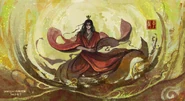
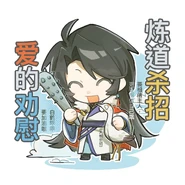

《人祖传》是网络小说《蛊真人》中构建的创世神话与哲学寓言，它不仅奠定了该作品奇诡、冷酷的世界观基石，更通过"人祖"与各种"蛊虫"的博弈，深刻解构了人性、欲望、规则与自我认知的辩证关系，是一部充满存在主义色彩的黑暗文学典籍。

---

## 一、内容核心：从荒蛮生存到精神觉醒

《人祖传》记载了人类始祖"人祖"及其十名子女的传奇经历。故事从人祖在野兽"困境"的包围中艰难生存开始，通过他与各种具有人格化特征的"蛊虫"（如希望、力量、智慧、规矩、态度等）进行交易与博弈，展现了人类文明从物质匮乏到精神异化，再到寻找"自我"的全过程。

### 生存的代价

人祖用青春供养"力量"，用中年供养"智慧"，最终只能将"心"交给"希望"以驱散"困境"。这隐喻了人类在不同生命阶段对资源的置换与依赖。

### 规则的诞生

人祖通过降服"规"与"矩"两只蛊，获得了捕捉万蛊的能力，但也因此陷入了"规则"的束缚。每一次权力的行使都伴随着新的禁令，揭示了力量与代价的守恒定律。

### 血脉与传承

人祖因无法忍受"孤独之心"的痛苦，挖出双眼化为长子太日阳莽与次女古月阴荒，其后续子女（如北冥冰魄、森海轮回等）分别代表了不同的自然法则与人生志向，构成了蛊世界流派的源头。

---

## 二、深度解构：寓言背后的哲学隐喻

《人祖传》之所以被誉为"半部蛊界史"，在于其极高的文学象征意义与哲学深度，它将抽象的人生哲理具象化为残酷的生存竞赛。

### 1. 存在主义的困境：外力与本心的博弈

人祖在失去力量与智慧后，发现唯有扎根于内心的"希望"能对抗"困境"。然而，当他试图通过"态度面具"来伪装自己时，却被告知"无心者戴不上态度"。这深刻地揭示了：当一个人为了生存彻底异化、丧失本心后，连虚假的伪装都将失去支撑。

### 2. 认知论的残酷：智慧的欺骗性

书中"智慧蛊"的逃脱极具讽刺意味。人祖利用"规矩"捕捉智慧，却被智慧诱骗说出了规矩的真名，导致智慧重获自由。这象征着：智慧永远在试图突破规则的封锁，而人类往往在自以为掌控真理时，反而被真理所玩弄。

### 3. 成功的悖论：自我丧失的代价

古月阴荒在"成败山"寻找"成功蛊"的片段是全书的高潮之一。她踏着石人的尸体而上，最终却触碰了"失败蛊"并迷失自我。这寓言式地指出：在追求成功的极端路径中，最大的失败不是未达目标，而是在竞争中彻底丧失了独立的人格与自我意识。

---

## 三、规则共识：力量与代价的守恒定律

在《人祖传》的语境下，规则不是被保护的契约，而是获取力量的"租金"。

### 双向束缚的契约

人祖降服"规矩二蛊"后发现，每下一道指令，就必须增加一条禁令（如"不能捕捉重复蛊"、"一次仅限一只"）。这揭示了一个残酷的社会共识：你对世界的掌控力越强，你受到的系统性约束就越多。强者并非绝对自由，而是活在更精密的规则网格中。

### 真名的权力逻辑

智慧蛊通过骗取"规矩"的真名而脱困，说明规则只对"无知者"有效。一旦规则的底层逻辑（真名）被识破，规则就会失效。这隐喻了信息不对称是维持社会规则共识的基础。

### 宿命与偶然的对抗

书中提到"命途"是由宿命蛊踏出的，这意味着世界存在一个"既定轨道"。但北冥冰魄借"意外蛊"脱困，打破了规则的闭环。这达成了一种共识：系统虽然严密，但"意外"是唯一的变数。

---

## 四、蛊虫：人格化的本能与欲望载体

《人祖传》中的蛊虫并非简单的工具，而是人类性格碎片与生存本能的实体化。

### 异化与共生

蛊虫需要用人类的"青春"、"中年"、"心"来供养。这意味着人类追求的特质（力量、智慧、希望）并非天生拥有，而是通过牺牲时间与情感换取的。人与蛊的关系，本质上是人与欲望的寄生关系。

### 功能的哲学指向

- **希望蛊**：它是最孱弱的光点，却能驱散最强大的"困境"。这说明希望不具备物理攻击力，但具备改变主观世界认知的能力。
- **态度蛊**：它是心的面具。无心之人戴不上态度，意味着没有真诚情感支撑的行为，只是无法贴合的伪装。
- **自己蛊**：这是最特殊的蛊，它通过吞噬其他蛊的碎片（如力量碎片）来成长。它代表了自我认知的整合，是唯一能让个体在平凡深渊中独立行走的力量。

---

## 五、等级体系：从"生命层级"到"认知高度"

虽然《人祖传》没有明写一转到九转的数字等级，但它构建了一套基于"生命价值"与"真理掌握"的等级体系：

### 食物链底端（荒蛮状态）

茹毛饮血的人祖，受困于名为"困境"的野兽。这是纯粹的生存等级，弱者为食。

### 交易等级（资本状态）

拥有力量蛊、智慧蛊的人祖。这一等级通过"交换"（用生命换取功能）来提升生存位阶，但这种位阶是脆弱的，一旦交易物（寿命）耗尽，等级就会崩塌。

### 神话等级（法则状态）

人祖的十个子女。他们化身为自然法则（如太阳、月亮），代表了世界运行的底层代码。他们不再受困于普通生存，而是受困于"成功的迷失"或"意义的寻找"。

### 终极等级（自我觉醒）

拥有"自己蛊"并走出"人生路"的状态。这超越了所有的外在蛊虫，代表了在残酷宇宙中实现主体性的最高等级。

---

## 六、所有人都要做的事：寻找、交易与突围

在《人祖传》所描述的世界里，所有生灵（人、蛊、异人）的行为模式高度统一：

### 寻找"支撑物"

人祖寻找蛊，子女寻找成功、寻找意义、寻找救父的方法。所有人都在寻找一种能证明自己存在价值的"外物"。

### 永恒的交易

没有什么是免费的。想要成功就要面对失败蛊的风险，想要爱情就要面对石人的阻拦。生存就是一场不断计算成本与收益的博弈。

### 对抗"困境"与"平凡"

无论是个体还是群体，终其一生都在做两件事：一是逃离名为"困境"的追杀，二是试图从"平凡深渊"的泥潭中爬出来。这是一种永无止境的向上攀爬运动。

---

## 七、生存哲学：悲剧性的英雄主义

《人祖传》的生存哲学可以概括为：在认清生命虚无的本质后，依然选择通过痛苦的自我构建来对抗宿命。

### 孤独是进化的动力

人祖因为无法忍受"孤独之心"而创造子女，虽然带来了纷争，但也开启了文明。孤独被视为人类所有创造性行为的根源。

### 失败的必然性

古月阴荒触碰失败蛊，人祖救子功亏一篑。这传达了一种哲学：追求卓越的过程必然伴随着异化与失败。失败不是结果，而是追求成功过程中的常态。

### "独立"之翼与"成就"之树

最终的生存哲学落脚于"独立"。人祖在平凡深渊中，依靠思想蛊点化的"独立"之翼，用自己的心血浇灌"成就之树"。这说明真正的生存不是征服外界，而是在荒诞的世界中种下属于自己的意义，哪怕这棵树最终会倒塌，但攀爬的过程就是生存的全部。

---

## 八、冷酷现实主义下的"英雄主义"

从文学评价与社会学角度来看，《人祖传》是一部极具张力的"反神话"。

### 它彻底解构了传统神话的温情

不同于传统创世神话中神对人的眷顾，《人祖传》中的人祖是极其被动的，他与蛊虫的关系是血淋淋的交易。这种设定反映了极致的现实主义：世界上没有无缘无故的救赎，所有的获得都有其标价。

### 它定义了一种"黑暗中的英雄主义"

人祖在"落魄谷"中孕育出"自己蛊"，标志着他从依赖外物（力量、智慧、希望）转向内在觉醒。人祖即便在"平凡深渊"中挣扎，也要种下"成就之树"，这种明知生命虚无却要在废墟上建立意义的行为，赋予了角色一种悲剧性的壮美。

### 它构建了完美的文学互文

作为《蛊真人》的书中书，它不仅为后期复杂的战斗体系（如"胆识蛊"、"定仙游"）提供了逻辑支撑，更在精神内核上与主角方源的逆天之路遥相呼应。它告诉读者：在这个充满规矩、宿命与困境的世界里，唯有走出一条"自己的路"，才是真正的解脱。

---

## 结语

《人祖传》不仅是奇幻设定的补充，它更像是一面镜子，映照出人类在欲望丛林中不断挣扎、妥协又试图超越的真实写照。它告诉我们：人类的文明史就是一部不断用宝贵的东西（情感、时间、纯真）去换取生存工具（力量、规则、伪装）的血泪史。但在这种冷酷的博弈中，它依然保留了一丝微光——即那只名为"自己"的蛊。它提醒每一个在"平凡深渊"中挣扎的人：世界是规矩的网，而你是唯一的网外之鱼。