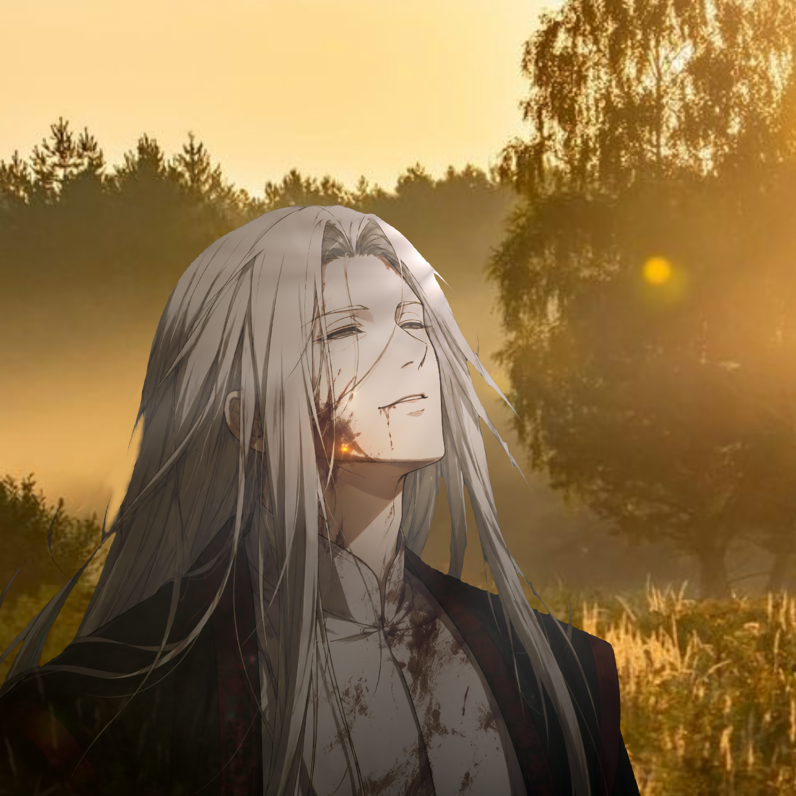

## 《蛊真人》诗集总览

方源一生，从落魄少年到九转魔尊，其诗词贯穿始终。既有"白雪尽皑皑，天地我独行"的孤寂，也有"今朝剑指叠云处，炼蛊炼人还炼天"的豪情。十二尊者各有其道，诗词亦各具风采，共同构成了蛊界宏大的史诗画卷。

本诗集收录《蛊真人》相关诗歌作品共计58首，分为四辑：

---

### 📖 第一辑：原著诗歌（20首）

> 小说正文出现的诗歌作品，按章节排序

包含方源、凤九歌、红莲魔尊、白凝冰、无极魔尊等角色在小说各章节中的诗句。

[→ 阅读第一辑：原著诗歌](./原著诗歌/)

---

### 📖 第二辑：十二尊者成尊诗（22首）

> 十二位尊者的成尊诗篇，展现各大道主的风采

元始仙尊、星宿仙尊、无极魔尊、狂蛮魔尊、红莲魔尊、元莲仙尊、盗天魔尊、巨阳仙尊、幽魂魔尊、乐土仙尊、炼天魔尊（方源）——十二尊者各有其道，诗词亦各具风采。

[→ 阅读第二辑：十二尊者成尊诗](./十二尊者成尊诗/)

---

### 📖 第三辑：其他角色诗歌（8首）

> 武庸、秦百胜、吴帅、梦求真、柳贯一、白凝冰等角色的诗歌

展现蛊界其他重要角色的豪情与悲歌。

[→ 阅读第三辑：其他角色诗歌](./其他角色诗歌/)

---

### 📖 第四辑：杂诗与箴言（8首）

> 方源的名言、箴言与杂诗

包含方源的无足鸟之悟、人间沧桑、魔之箴言、生死观、恩怨分明、正道批判等经典语句。

[→ 阅读第四辑：杂诗与箴言](./杂诗与箴言/)

---

## 免责声明

本诗集收录《蛊真人》相关诗歌作品，来源于网络搜索和读者整理。由于小说已下架，部分诗歌的出处难以完全考证。标注为"原著诗歌"的作品，依据网络社区共识和Fandom Wiki记载；标注为"二创诗歌"的作品，为读者同人创作或改编。如发现有误或遗漏，欢迎指正补充。

---

> "早岁已知世事艰，仍许飞鸿荡云间。一路寒风身如絮，命海沉浮客独行。千磨万击心铸铁，殚精竭虑铸一剑。今朝剑指叠云处，炼蛊炼人还炼天！"——方源