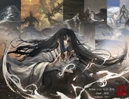

[← 返回诗集总览](../)

---

## 第二辑：十二尊者成尊诗

十二位尊者各有其道，诗词亦各具风采，共22首。

---

### 元始仙尊（人祖）·人道道主

> 星火燎原耀中州，异人霸业就此收。
>
> 独尊力挽天下势，不绝贤路贯古通。
>
> 气海无量命有数，星盘罗布传火忙。
>
> 不为子孙谋仙位，只求人族世界殊。

---

### 元始仙尊（版本二）

> 元为混乱始，天地一合分。
>
> 自然万族竞，个个迫人存。
>
> 残喘艰何巨，立命改天伦。
>
> 五域九天变，执念造乾坤。

---

### 星宿仙尊·运道道主

> 一生不利己，忧济在元元。
>
> 捐躯赴难死，星光照人间。
>
> 重活物人非，五洲大不同。
>
> 丹心唯一一，三相挽天倾！

---

### 星宿仙尊·运道道主（版本二）

> 三百万年转瞬封，半为天意半为空。
>
> 算尽天下穷心力，逆转宿命显神通。
>
> 红莲涅火焚天下，天魔无相乱中州。
>
> 气贯五域天地阔，重振天庭舞清风。

---

### 星宿仙尊·运道道主（版本三）

> 歌声寥落，英雄落魄，难挡命途多舛。
>
> 折剑沉沙，千古兴亡，不尽天河滚荡。
>
> 幽夜漫漫魂梦长，问何处安乡？
>
> 物换心移几春秋，唯天意苍茫。

---

### 星宿仙尊·运道道主（版本四）

> 从来济人道，忧思两难间。
>
> 此身便决弃，星魂葬天山。
>
> 思量早自忘，乱起重破棺。
>
> 漾眸敛心头，一生为哪般？

---

### 无极魔尊·律道道主

> 规矩为盘律为棋，世间万法皆可寻。
>
> 初入江湖开魔道，三战气绝试锋芒。
>
> 岁月忽晚生白发，书山无尽少年华。
>
> 衍天化地穷神力，师法万界道自然。

---

### 狂蛮魔尊·力道道主

> 变化万千心如常，男儿何须把貌藏。
>
> 图腾方显阳刚美，披风当衬威风郎。
>
> 大荒无界野花香，杀尽异族顾八荒。
>
> 直入天庭戏天女，仰天大笑出帝关。

---

### 狂蛮魔尊·力道道主（版本二）

> 图腾方显阳刚美，披风当衬威风郎。
>
> 杀尽异族顾八荒，直入天庭戏天女。

---

### 红莲魔尊·宙道道主

> 当时年少掷春光，花马踏蹄酒溅香。
>
> 爱恨情仇随浪来，夏蝉歌醒夜未央。
>
> 光阴长河种红莲，韶光重回泪已干。
>
> 今刻沧桑登舞榭，万灵且待命无缰！

---

### 红莲魔尊·宙道道主（版本二）

> 无限轮回无限伤，可怜青丝满沧桑。
>
> 成尊称王非我意，只愿真情破天苍。

---

### 元莲仙尊·墓道道主

> 江山如画马如龙，青衫入世显从容。
>
> 恶浪滚滚海天斜，衣袖飘飘定坤乾。
>
> 身结因果明乱象，逆流河里泪已干。
>
> 不渡红尘继人道，春风化雨沐新尘。

---

### 元莲仙尊·墓道道主（版本二）

> 江山如画马如龙，青衫入世显从容。
>
> 不渡红尘继人道，春风化雨沐星尘。

---

### 盗天魔尊·偷道道主

> 大漠孤洲起星芒，天外孤魂牵断肠。
>
> 自身本是轮回客，不知何处话桑麻。
>
> 星海苍苍断银汉，空门悠悠绝思量。
>
> 踏遍万里寻归途，破尽无间觅家乡。
>
> 人力有穷天无尽，留待有缘再出发。

---

### 巨阳仙尊·运道道主

> 鸿运齐天福禄多，天下不过一掌中。
>
> 美人燕燕环宫阙，牧草萧萧向北风。
>
> 金光难掩岁月暮，定鼎王庭立千秋。
>
> 家国万载传天下，今宵再看笑中州。

---

### 巨阳仙尊·运道道主（版本二）

> 运数多变藏玄机，命运无常唯真意。
>
> 风云汹涌生不息，众生天地相辉映。

---

### 幽魂魔尊·魂道道主

> 魂牵梦绕风云荡，星圆土方三界坛。
>
> 生死轮回一门开，再启杀劫洗铅华。

---

### 幽魂魔尊·魂道道主（版本二）

> 亿万亡灵高千丈，杀途纵横五域荒。
>
> 阴风掠起落魄谷，一朝证道魂山荡。
>
> 生死门开天意乱，惊动三尊吞阳莽。
>
> 九火两天皆为食，影暗骇世十绝芒。

---

### 乐土仙尊·土道道主

> 沉沦黄土十万年，今再扬尘拂行衣。
>
> 只愿苍生共平等，万千生灵竞相揖。

---

### 乐土仙尊·土道道主（版本二）

> 面朝黄土背朝天，万千生灵系心间。
>
> 纷争难解天下事，干戈易结百年身。
>
> 百姓安居天庭业，苍生共济乐土中。
>
> 轮回不忘初时志，只教正气唤新风。

---

### 炼天魔尊（方源）·炼道道主

> 早岁已知世事艰，仍许飞鸿荡云间。
>
> 一路寒风身如絮，命海沉浮客独行。
>
> 千磨万击心铸铁，殚精竭虑铸一剑。
>
> 今朝剑指叠云处，炼蛊炼人还炼天！

---

[← 返回诗集总览](../)